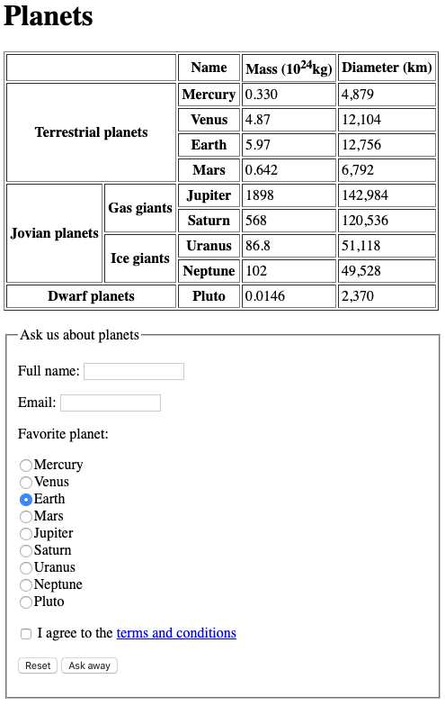

# Homework 1 - HTML Basic

Create an index.html page that looks like the below image.

For the table feel free to copy the actual numbers from the [Excel file](Planets.xlsx). Commit and push your work to this repository.

In the form:

- When you click on a label the corresponding input is **toggled or focused**
- Earth is **selected by default**
- The reset button **actually empties the form**
- The `Ask away` button submits the form to the current page but the URL should now contain the data entered in the form, like this: `index.html?name=Paul+Negoescu&email=paul.negoescu%40email.com&planet=saturn&agree=on`
- Name, email and the agreement are required and the email is validated
